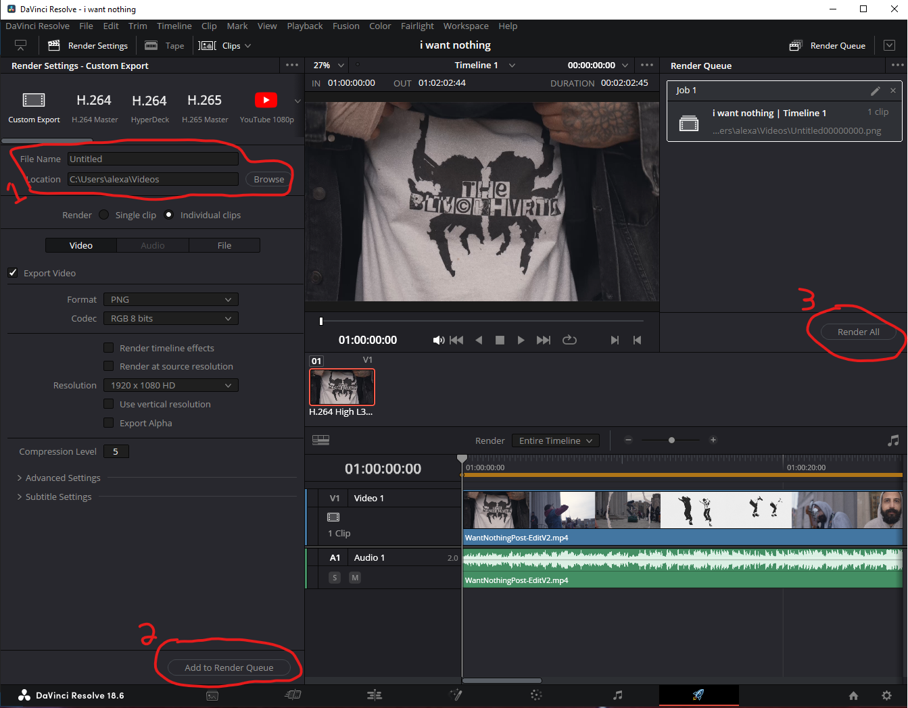

<h1>Video to Image Conversion for Raspberry Pi Pico SSD1306 OLED Display</h1>
<h2>Overview</h2>
This project aims to provide a solution for displaying videos on the SSD1306 OLED display connected to a Raspberry Pi Pico. Since the display has limitations in playing videos directly, we use DaVinci Resolve to convert the video into a sequence of images. These images are then converted to PBM format using ImageMagick and displayed on the <a href="https://esphome.io/components/display/ssd1306.html">SSD1306 OLED screen</a>  using Python and the framebuf module.

<h3>Steps</h3>
<ol>
  <li>Download Required tools</li>
  <li>Use DaVinci Resolve to save the video as multiple images
    <ul>
      <li>Upload your video file to DaVinci Resolve.</li>
      <li>Click the render tab at the bottom right of the screen.</li>
      
      <li>Navigate to the individual clip option on the left and note the export format you chose.</li>
      
      <li>Choose your export folder and click render at the bottom.</li>
      
    </ul>
  </li>
  <li>Use the provided Python script to convert BMP images to PBM format using ImageMagick
    <ul>
      <li>Open the imagetobpm.py file.</li>
      <li>Replace the destination of input_folder with the folder where you saved the files from DaVinci Resolve.</li>
      <pre>input_folder = "/users/documents/input_folder"</pre>
      <li>Replace the destination of output_folder with where you want converted images to be saved.</li>
      <pre>output_folder = "/users/documents/output_folder"</pre>
      <li>Run the script in the terminal to convert the images to PBM format in the output_folder.</li>
      <pre>python imagetobpm.py</pre>
    </ul>
  </li>
  <li>
    Display the converted images on your SSD1306 OLED display using framebuf.
    <ul>
      <li>Store the images on an SD drive connected to the Raspberry Pi Pico.</li>
      <li>Copy the main.py file to your Thonny IDE.</li>
      <li>Change the path to your folder with your PBM images (e.g., file_path = '/sd/pbm_converted').</li>
      <li>Run the Thonny program.</li>
    </ul>
  </li>
</ol>

<h3>Save video as image files</h3>
<ol>
<li>upload your video file you want to divinci resolve and click the render tab at the bottom right of the screen(circled in red on the image)</li>

<li>Navigate on the left to the individual clip option and remember what export format you chose. You will need it for you Magick image Convert</li>

<li>choose your export folder and click render at the bottom</li>

</ol>

<h3>-Convert Images with Magick</h3>

<ol>
  <li>Open the imagetobpm.py file.</li>
  <li>replace destination of input_folder to where you saved the files from divinci.</li>
  <pre>input_folder = "/users/documents/input_folder"</pre>
  <li>replace destination of output_folder to where you want converted images to be saved.</li>
  <pre>input_folder = "/users/documents/output_folder"</pre>
  <li>Run the script in temrinal to convert the images to PBM format in the output_folder.</li>
  <pre>python imagetobpm.py</pre>
</ol>

<h2>Loading images to raspberry pico w with thonny</h2>

-Ive stored my images on a SD drive ive connected to my raspberry pico, i suggest research expanding stoarage space for larger video lengths

-copy the main.py files to your thonny ide 

<ol>
  <li>Change the path to your folder with your bpm images, my images are located in my sd folder</li>
  <pre>file_path = '/sd/pbm_converted'</pre>
  <li>Run Thoony program</li>
</ol>

<h2>Errors and road blocks</h2>
<ul>
  <li>Remmeber to keep image size of 128 x 64 as its the native resolution of the screen</li>
  <li>You can adjust the color invert to better display your image if needed</li>
  <pre> oled.invert(1)</pre>
  or
  <pre>oled.invert(0)</pre>
  <li>file memory on pico is minimal. expanding to sd would give ability for larger files</li>
</ul>

