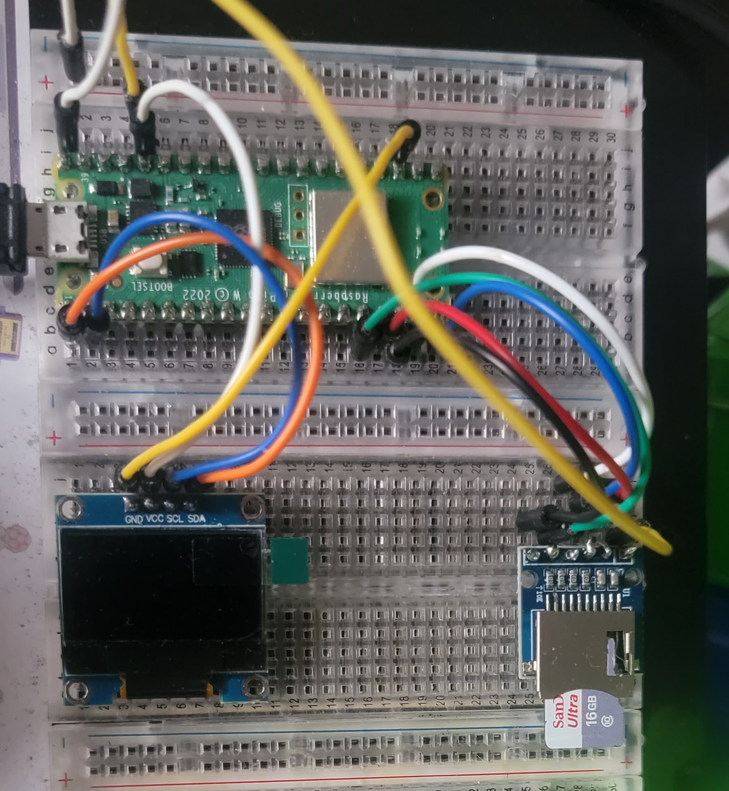

# Video to Image Conversion for Raspberry Pi Pico SSD1306 OLED Display

## Overview
This project aims to provide a solution for displaying videos on the SSD1306 OLED display connected to a Raspberry Pi Pico. Since the display has limitations in playing videos directly, we use DaVinci Resolve to convert the video into a sequence of images. These images are then converted to PBM format using ImageMagick and displayed on the [SSD1306 OLED screen](https://esphome.io/components/display/ssd1306.html) using Python and the framebuf module.

### Steps
1. **Download all required tools**
   - Python 3.5 or later
   - [Divinci Resolve](https://www.blackmagicdesign.com/products/davinciresolve)
   - [ImageMagick](https://imagemagick.org/index.php)

2. **Use DaVinci Resolve to save the video as multiple images**
   - Upload your video file to DaVinci Resolve.
   - Click the render tab at the bottom right of the screen.
   
   - Navigate to the individual clip option on the left and note the export format you chose.
   
   - Choose your export folder and click render at the bottom.
   

3. **Use the provided Python script to convert BMP images to PBM format using ImageMagick**
   - Open the `imagetobpm.py` file.
   - Replace the destination of `input_folder` with the folder where you saved the files from DaVinci Resolve.
     ```
     input_folder = "/users/documents/input_folder"
     ```
   - Replace the destination of `output_folder` with where you want converted images to be saved.
     ```
     output_folder = "/users/documents/output_folder"
     ```
   - Run the script in the terminal to convert the images to PBM format in the `output_folder`.
     ```
     python imagetobpm.py
     ```
   **My wiring**
    
5. **Display the converted images on your SSD1306 OLED display using framebuf**
   - Store the images on an SD drive connected to the Raspberry Pi Pico. If you dont have one here is some helpful videos to navigate through the process. [SD Card Setup](https://www.youtube.com/watch?v=PSjzymhL4I0&t=780s)
   - Some troubleshoot will be needed for first time users, but be patient and do one pin at a time. Color wired organization is really helpful. Dont give up.
   - Copy the `main.py` file to your Thonny IDE.
   - Change the path to your folder with your PBM images (e.g., `file_path = '/sd/pbm_converted'`).
   - Run the Thonny program.

## Tips and Considerations
- **Image Size:** Keep the image size at 128 x 64, as it's the native resolution of the SSD1306 OLED screen.
- **Color Invert:** You can adjust the color invert to better display your image if needed.
